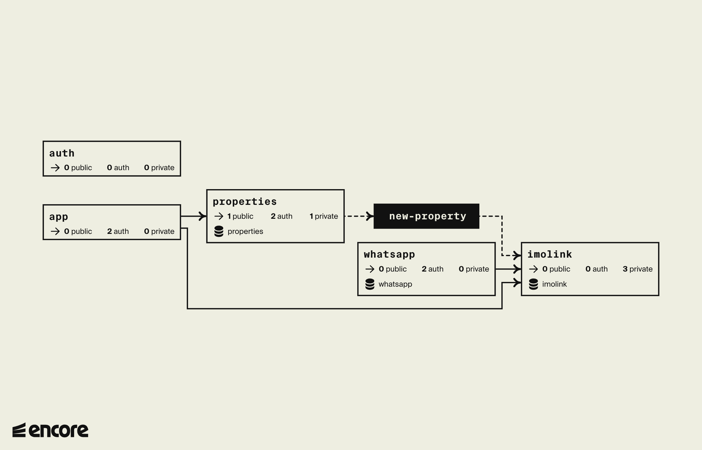

# Imolink

**Imolink** is a real estate platform that integrates with WhatsApp to provide property information and interactions through a chatbot. The platform uses OpenAI for natural language processing and PostgreSQL for data storage and embedding distance calculations.

## Features

**WhatsApp Integration**: Connect and interact with users via WhatsApp.

**Property Management**: Add, retrieve, and serve property details.

**AI-Powered Chatbot**: Use OpenAI to answer user queries and provide property recommendations.

**Authentication**: Secure API endpoints with token-based authentication.

## Architecture

The Imolink application is built using a microservices architecture, with each service handling a specific set of tasks.



## Services

### WhatsApp Service

Handles WhatsApp client connections and interactions.

**Connect**: `GET /whatsapp/connect` - Connects to WhatsApp and provides a QR code for login.
**Reconnect**: `GET /whatsapp/reconnect` - Reconnects to WhatsApp using stored device information.

### Properties Service

Manages property data and serves property details.

**Create Properties**: `POST /properties` - Adds new properties to the database. Whenever new properties are added, the properties service publishes a message to the imolink service to train the AI model incrementally. On successive calls, the chatbot will return updated recommendations based on the new data.

**List Properties**: `GET /properties` - Retrieves all properties.

**Serve Property**: `GET /properties/:ref` - Serves property details as an HTML page.
Whenever the chatbot recommends a property, it will provide a link to the property details page. This page is generated by the properties service and contains all the property details.

**Delete Properties**: `DELETE /properties` - Deletes all properties from the database.

### Imolink Service

Handles AI interactions and embeddings.

**Ask Question**: `POST /imolink/question` - Processes user questions and provides AI-generated answers.

**Add Training Data**: `POST /imolink/training-data` - Trains the AI model with new data.

**Remove Training Data**: `DELETE /imolink/training-data` - Purges all embeddings from the database.

### Auth Service

Provides authentication for API endpoints.

**AuthHandler**: Validates bearer tokens for secure access.

### App Service

Utility service for administrative tasks.

**Sample**: `POST /sample` - Purges all data and adds sample properties to the database.

**Purge**: `DELETE /sample` - Purges all data from Imolink and Properties services.

## Setup

**Install Docker**: Install Docker and Docker Compose on your machine.

**Install Encore**: Install the Encore CLI tool for managing services.

## Usage

**Start Services**: Run the services using Encore.

```bash
encore run
```

On initialization, the Imolink application starts all services and connects to the last known WhatsApp device.

The app will use any existing properties and embeddings in the database. If you want to start fresh, you can purge the data using the `/sample` endpoint.

If there are no existing properties, and therefore no embeddings, the AI model will not be able to provide recommendations until new properties are added.

To solve this, you can add properties using the `/properties` endpoint, which will trigger the training of the AI model.

At any time, you can add new properties, which will trigger the training of the AI model incrementally.

Be careful about duplicate data, as the AI model will be trained with the same data multiple times. No validation is done to prevent this at the moment.

After running Encore, you can access the dashboard at http://localhost:9400/imolink-cmr2. The dashboard provides an overview of all services and their endpoints.

**Connect to WhatsApp**: Access the `GET /whatsapp/connect` endpoint to connect the WhatsApp client.

**Manage Properties**: Use the `GET /properties` endpoints to add and retrieve property data.

**Interact with AI**: Send messages to the **WhatsApp chatbot** to ask questions and get suggestions about properties.

## Authentication

The Imolink API uses token-based authentication to secure access to its endpoints.

You can access the endpoints by providing a bearer token in the Authorization header. The token is the *password* for the imolink app encoded in base64.

To generate the token, you can use the following command:

```bash
echo -n 'password' | base64
```
